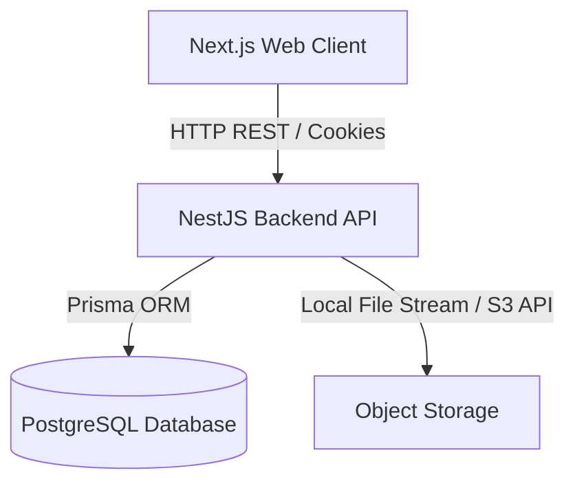
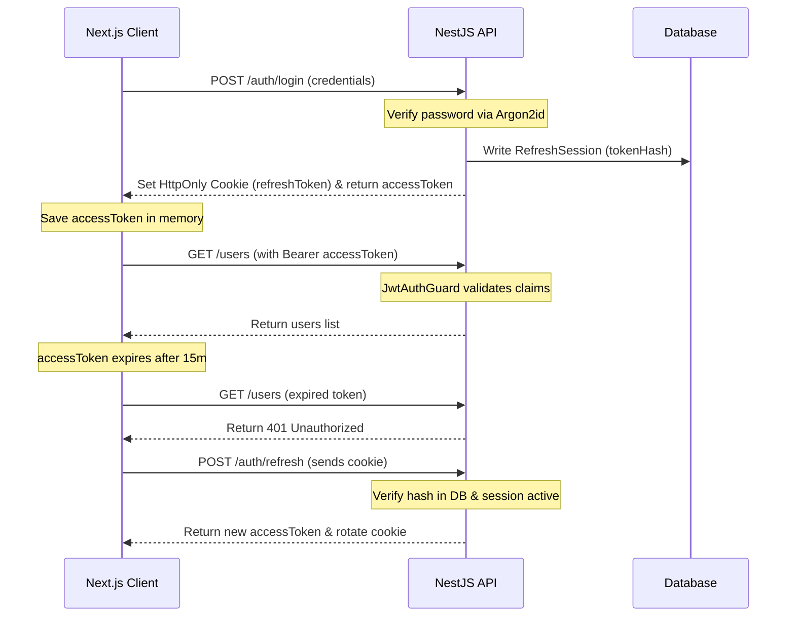

# System Architecture Document — RepairFlow

This document outlines the high-level system architecture, technology selections, data flows, and security mechanics for the **RepairFlow** Electronics Repair Shop Management Platform.

---

## 1. System Overview

RepairFlow is built as a modular monorepo containing a Next.js web application, a NestJS backend API, and shared TypeScript configuration and validation packages.



### Key Technology Selection

- **Monorepo Manager**: `pnpm` workspaces for package link caching, and Turborepo for build orchestrations.
- **Frontend**: Next.js (App Router), Tailwind CSS for styled layout elements, and TanStack Query for cache synchronization.
- **Backend**: NestJS framework, structured in domain-driven modules.
- **Database Layer**: PostgreSQL database managed via Prisma ORM for type-safe queries.

---

## 2. Monorepo Structure

```text
repairflow-platform/
├── apps/
│   ├── web/           # Next.js Frontend
│   └── api/           # NestJS Backend API
├── packages/
│   ├── shared-types/  # Common TypeScript types
│   ├── validation/    # Shared Zod validation schemas
│   ├── typescript-config/
│   └── eslint-config/
├── docs/              # System guides & specifications
```

---

## 3. Frontend Architecture

The frontend Next.js App Router enforces a modular component structure:

- **Features**: Domain directories (e.g., `features/repair-tickets/`) group domain api calls, helper hooks, forms, and custom components.
- **API Client**: Axios client configured with credentials support. Interceptors catch `401 Unauthorized` responses and trigger token refreshes.
- **State Management**: TanStack Query manages server state. Form validation is performed using React Hook Form + Zod.

---

## 4. Backend Architecture

The NestJS backend isolates business responsibilities:

- **Controllers**: Expose REST endpoints, validate parameters, and forward data to services.
- **Services**: Handle business logic, pricing computations, database transactions, and audit trail outputs.
- **Guards**: Enforce session verification (`JwtAuthGuard`), role checks (`RolesGuard`), and branch boundaries (`BranchAccessGuard`).
- **Filters**: Catch all system errors and format them into a uniform error response payload.

---

## 5. Security & Authentication Blueprint



### Security Highlights

- **Rotating Refresh Tokens**: Each refresh call revokes the old token and writes a new session. If a revoked token is used, all sessions for the user are terminated immediately.
- **Branch Isolation**: Non-admin users are restricted. The `BranchAccessGuard` verifies the `branchId` in parameters matches the user's assigned branches.

---

## 6. Technical Decisions & Rejected Alternatives

### 1. Integer Cents vs. Floating Points

- **Decision**: All financial fields (prices, taxes, discounts) are computed and stored as **integers in minor units (cents)**.
- **Rationale**: Floating-point representations (e.g. `double`, `float`) introduce rounding errors during aggregate sums. Storing values as integers ensures 100% mathematical accuracy.

### 2. NestJS Monolith vs. Microservices

- **Decision**: Built as a modular monolithic NestJS application.
- **Rationale**: A microservices setup introduces network latencies, transaction distributed complexities, and operational build pipelines. A modular monolith provides clean code boundaries and easy scalability while maintaining low development overhead.
