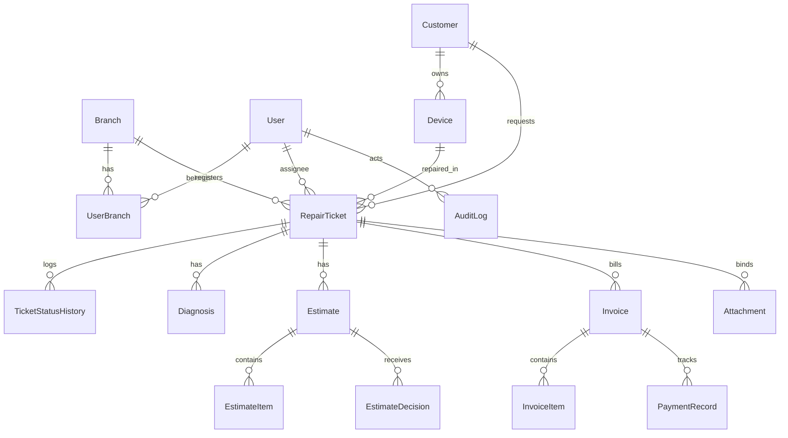

# Database Design Document — RepairFlow

This document outlines the database schema, entity relationships, indexing strategies, audit policies, and backup/restore guidelines for the **RepairFlow** platform.

---

## 1. Database Architecture & ER Diagram

We use a managed PostgreSQL instance with Prisma ORM. UUIDs are used for internal primary keys, and sequential counters (generated inside thread-safe transactions) are used for user-facing document numbers.

---

## 2. Entity Descriptions & Schema Definitions

* **Branch**: Store coordinates, phone numbers, addresses, and status flags. Unique constraints on code (e.g. `SHP01`) and email.
* **User**: Staff credentials (Argon2 hashes), status (ACTIVE, SUSPENDED), failed attempt counts, and lock parameters.
* **Customer**: Profile details. Soft-delete flag `deletedAt` filters deleted customer data but preserves historical billing records.
* **Device**: Categorized devices linked to owners. Category index + Brand/Model indexes optimize client search filters.
* **RepairTicket**: Master repair logs linking customer, device, branch, technician, expected delivery date, problem description, and current status.
* **Estimate**: Proposed repair charges. Contains subtotal, tax, discount, and final calculated amounts.
* **Invoice**: Final payment statements linked to repair tickets. Status ranges from UNPAID to PAID.
* **AuditLog**: Immutable, append-only logs recording the actor, action, and JSON strings of changed values.

---

## 3. Storage Strategies

### 1. Money Strategy (Minor Units)
To avoid standard IEEE-754 floating-point rounding errors during financial calculations:
* **Integer Cents**: All financial amounts (unit prices, tax rates, subtotals, invoice balances) are stored as **integers in minor units (cents / paise)** in the database.
* **Examples**: A repair charge of `$120.50` is stored as `12050` in the database. Next.js formatting is applied at the render layer.

### 2. Deletion Strategy
* **Financial Integrity**: Invoices, payment records, and estimates cannot be hard-deleted.
* **Soft Deletes**: Customers have a nullable `deletedAt` column. When a customer is deleted, they are omitted from autocomplete search lists, but their associated invoices and tickets remain in the database for auditing purposes.

### 3. Audit Strategy
* **Immutable Logs**: The `AuditLog` table has no corresponding edit or delete endpoints in the API. It is append-only.
* **Secret Redaction**: When creating audit logs, service helpers strip sensitive keys (e.g., `passwordHash`, `tokenHash`) and replace them with `[REDACTED]` prior to writing JSON states.
